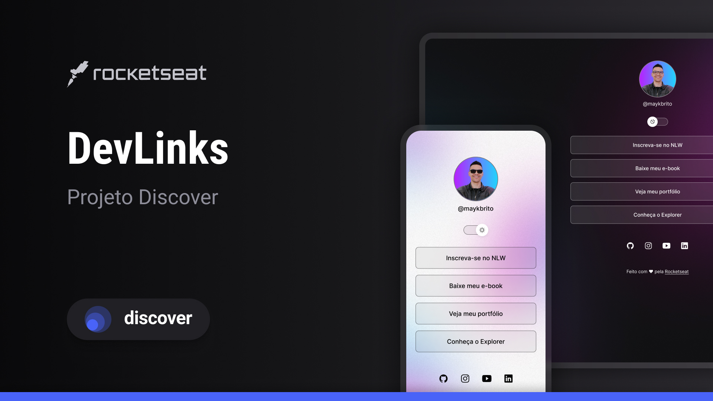

<h1 align="center"> DevLinks </h1>

Programa exclusivo e gratuito, promovido pela Rocketseat para ensino de tecnologia WEB.

  <a href="#-tecnologias">Tecnologias</a>&nbsp;&nbsp;&nbsp;|&nbsp;&nbsp;&nbsp;
  <a href="#-tecnologias">Projeto</a>&nbsp;&nbsp;&nbsp;|&nbsp;&nbsp;&nbsp;
  <a href="#-tecnologias">Layout</a>&nbsp;&nbsp;&nbsp;|&nbsp;&nbsp;&nbsp;
  <a href="#memo-licença">Licença</a>

  

 

  

## 🚀 Tecnologias

Esse projeto foi desenvolvido com as seguintes tecnologia:

- HTML e CSS
- JavaScript
- Git e GitHub
- Figma

## 💻 Projeto

O DevLinks é um agregador de links para usar como cartão de visitas online.

## 📝 Layout

Você pode visualizar o layout do projeto através. [DESSE LINK](https://www.figma.com/community/file/1187422022288947321)

## :memo: Licença

Esse projeto está sob licença MIT.

---

Feito com amor pela Rocketseat :wave: [Participe da nossa comunidade!](https://discord.gg/rocketseat)
